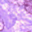
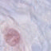
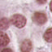
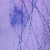
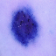
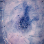
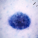
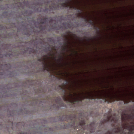
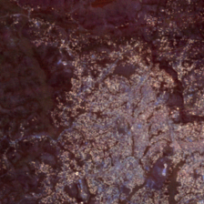

# Bayesian Scattering
A Bayesian scattering baseline for uncertainty quantification.

<style>
.wrapper {
  display: grid;
  grid-template-columns: repeat(3, 1fr);
  gap: 20px;
}

.column {
  display: grid;
  grid-template-columns: repeat(2, 1fr);
  gap: 10px;
}

.column img {
  width: 100%;
  height: auto;
  display: block;
}
</style>

<div class="wrapper">

  <div class="column">
    
    
    
    
  </div>

  <div class="column">
    
    
    
    
  </div>

  <div class="column">
    
    
    
    
  </div>

</div>

## Getting Started
Install `uv`:
```sh
curl -LsSf https://astral.sh/uv/install.sh | sh
```
Sync the environment and activate it:
```sh
uv sync
source .venv/bin/activate
```
Without installing the package, you can run the examples and benchmarks as Python modules:
```sh
python -m <path/to>.<script>
```
If you prefer to run the examples or benchmarks in JupyterLab, generate the `.ipynb` file:
```sh
jupytext --to ipynb <script>.py
```
Optionally, you can pair and sync the `.ipynb` and `.py` files to keep both updated:
```sh
jupytext --set-formats ipynb,py:percent <script>.ipynb
```
To run either the examples or the benchmarks, you need to specify three paths in each script:
```python
os.environ["DATA_PATH"] =
os.environ["FEATURES_PATH"] =
os.environ["RESULTS_PATH"] =
```
The first defines where the datasets are stored. The second defines where the generated features are stored, which avoids recomputing them every time you run a script. The third defines where the results are saved.
